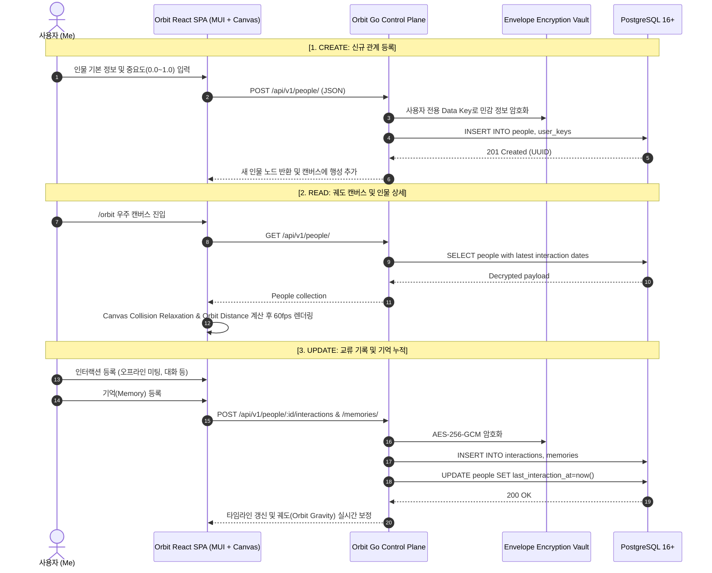

# Orbit 관계 관리 실무 매뉴얼 (CRU Manual)

본 문서는 Orbit 플랫폼에서 관계를 생성(Create), 조회 및 캔버스 시각화(Read), 상호작용 및 궤도 갱신(Update/Re-orbit)하는 전주기 시나리오와 데이터 아키텍처를 안내합니다.

---

## 1. 관계 수명주기 및 데이터 흐름

---

## 2. 세부 단계별 실무 가이드

### Phase 1: Create (새로운 관계 맺기)
1. **인물 기본 정의**:
   - `이름`: 인물의 성명 또는 친근한 호칭
   - `소속/직함`: 현재 활동 중인 조직 및 역할
   - `연락처/이메일`: 비공개 통신 수단
2. **관계 맥락 및 메모**:
   - `첫 만남 시기`: 인연이 시작된 연도/일시
   - `나만의 메모`: 업무적 역량, 공통 관심사, 기억하고 싶은 특성
3. **관계 중요도 (Importance & Gravity)**:
   - 0.0(아주 먼 외곽 궤도)부터 1.0(가장 가까운 내핵 궤도)까지 슬라이더로 조절
   - 슬라이더 수치와 최근 상호작용 빈도가 결합되어 Canvas 상의 행성 궤도 반경과 광도(Glow)가 결정됩니다.

---

### Phase 2: Read (우주 캔버스 조망 & 인물 상세)
- **Canvas 인터랙션**:
  - **Pan / Zoom**: 캔버스를 드래그하여 우주를 탐험하고 휠 스크롤로 줌 인/아웃
  - **Node Hover**: 행성에 마우스를 올리면 인물명, 소속, 최근 교류일 툴팁 노출
  - **Orbit Track**: 태양(나)을 중심으로 인물들이 회전하는 동적 궤도 라인
- **상세 프로필 (`/people/:id`)**:
  - 인물과의 총 인연 연수(Years known), 현재 궤도 상태(Now in Orbit)
  - 함께한 시간 타임라인을 통해 과거의 모든 미팅과 기억을 한눈에 열람

---

### Phase 3: Update (교류 및 기억 누적)
- **상호작용(Interaction) 등록**:
  - 만남 형태(대면 미팅, 전화, 메일, 메신저 등)와 나눈 대화 요약 기록
  - 등록 즉시 해당 인물의 `last_interaction_at`이 갱신되어 궤도가 활성화됩니다.
- **기억(Memory) 등록**:
  - 깊이 있는 교훈이나 중요 사실을 토픽 태그와 함께 등록
  - 등록된 기억은 사용자별 전용 봉투 암호화(Envelope Encryption)로 안전하게 격리 보관됩니다.

---

### Phase 4: AI Co-Pilot & Rediscover
- **과거 맥락 기반 대화**:
  - `/ai` 메뉴에서 특정 인물에 대한 과거 상호작용과 기억을 AI가 참조하여, 자연스러운 안부 메시지나 미팅 아젠다를 제안합니다.
- **Streamable HTTP MCP**:
  - `/mcp` 엔드포인트를 통해 외부 AI 에이전트 도구와 안전하게 관계 컨텍스트를 연동할 수 있습니다.
