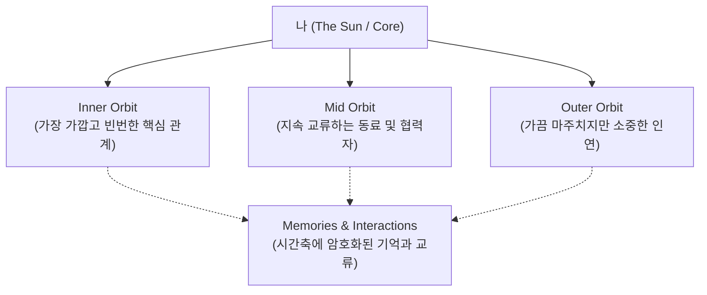
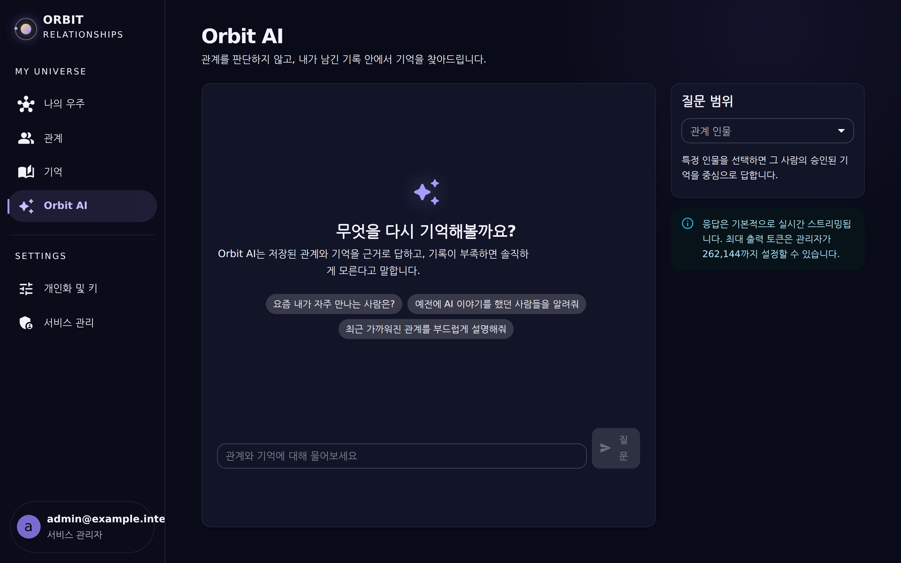
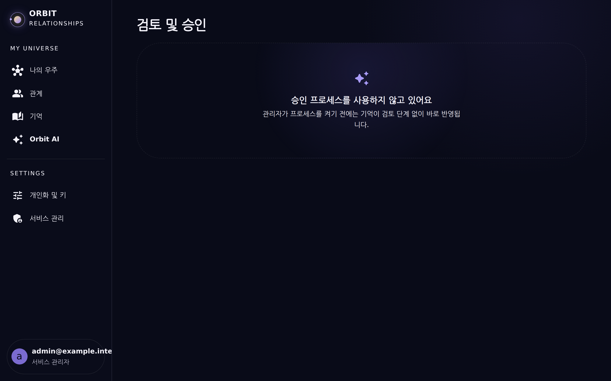
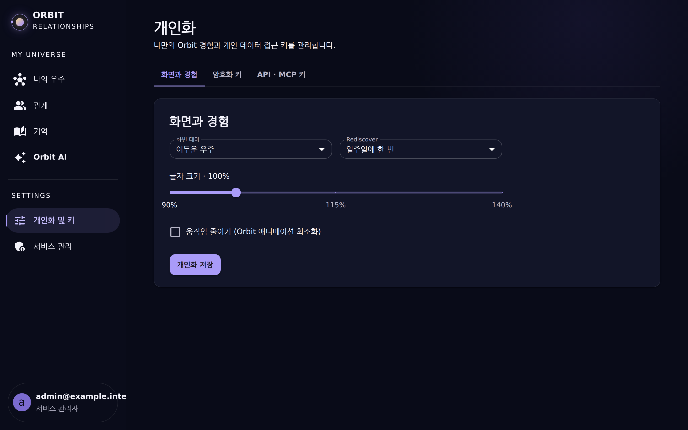

# Orbit 사용자 가이드 (User Guide)

> **"Your relationships have gravity."**  
> Orbit은 사람들을 단순한 CRM 점수나 정적인 연락처 목록으로 다루지 않고, 나와 그 사람 사이의 중력(Gravity)과 거리, 시간의 흐름을 하나의 우주(Universe)로 시각화하는 **Personal Relationship Universe Platform**입니다.

---

## 1. 핵심 철학 및 개념 (Core Concepts)

1. **Orbit Canvas (관계 우주)**:
   - 나 자신을 중심(항성)으로, 관계의 중요도(Importance)와 최근 상호작용 빈도에 따라 행성들의 궤도 반경과 회전 속도가 결정됩니다.
   - **Collision Relaxation**: 행성 노드들이 서로 겹치지 않고 자연스럽게 부드러운 위치를 찾아가는 물리 기반 캔버스입니다.
   - **Semantic Zoom**: 줌 레벨에 따라 전체 성단 조망부터 개별 인물의 상세 맥락까지 부드럽게 전환됩니다.
2. **Relationship Story & Timeline (관계 이야기)**:
   - 언제 처음 만났는지, 어떤 계기로 가까워졌는지, 나만의 메모를 기록합니다.
   - 대화, 오프라인 미팅, 메일 등 다양한 상호작용(Interactions)을 타임라인으로 누적합니다.
3. **Encrypted Memories (암호화된 기억)**:
   - 대화 요약과 개인적인 회고는 사용자별 **AES-256-GCM Envelope Encryption**으로 안전하게 암호화되어 저장됩니다.
4. **AI Relationship Co-Pilot**:
   - 오랜 시간 연락이 뜸해진 소중한 인연을 다시 연결(Rediscover)해주고, 나눈 기억을 바탕으로 대화 맥락을 제안합니다.

---

## 2. 화면별 기능 안내

### 2.1 로그인 및 인증 (`/login`)

- **로컬 Bootstrap 관리자** 및 **Keycloak OIDC Discovery/PKCE SSO** 완벽 지원
- 다크 엠비언트 테마의 미려한 우주 그래픽과 브랜드 매니페스토 제공

### 2.2 나의 Orbit 우주 캔버스 (`/orbit`)

- **Canvas Renderer**: HTML5 Canvas 기반의 고성능 60fps 렌더링
- 마우스 드래그(이동), 스크롤(줌 인/아웃), 노드 호버/클릭(인물 상세 진입)

### 2.3 관계 목록 및 관리 (CRU: Create & Read) (`/people`)
| 기능 | 화면 | 설명 |
| :--- | :--- | :--- |
| **인물 추가 모달** |  | 이름, 소속/직함, 첫 만남 시기, 관계 라벨, 중요도(중력) 슬라이더 |
| **관계 카드 그리드** |  | 궤도 상태, 소속, 최근 교류일, 카테고리 태그별 탐색 |

### 2.4 인물 상세 및 이야기 타임라인 (`/people/:id`)

- **관계 정보 요약**: 현재 궤도 상태(Now in Orbit), 소속, 첫 만남 시기, 나만의 메모
- **함께한 시간 타임라인**: 날짜별 교류 기록(Interaction)과 기억(Memory) 실시간 스트림

### 2.5 기억 관리 & Rediscover 타임캡슐 (`/memories`)

- 사람과 함께한 소중한 순간들을 토픽 태그와 함께 암호화 보존
- 시간이 지나 잊혀지기 쉬운 맥락을 지능적으로 환기

### 2.6 AI Relationship Co-Pilot (`/ai`)

- OpenAI Responses 호환 AI Gateway와 SSE 스트리밍 연동
- 인물과의 과거 기억을 참조하여 자연스러운 후속 교류 전략 및 메시지 초안 생성

### 2.7 검토 및 승인 프로세스 (`/approvals`)

- 엔터프라이즈 팀 환경에서 외부 이해관계자 관계 등록 시 팀장 승인/반려 거버넌스

### 2.8 개인화 & AES-256 데이터 키 관리 (`/personal`)

- 사용자별 고유 AES-256-GCM 암호화 키 확인, 무중단 키 회전, 개인 API Key 발급

### 2.9 서비스 관리 콘솔 (`/admin`)

- 서비스 기본 정보, Keycloak OIDC SSO Discovery, AI 모델 및 토큰 한도(최대 256K), RBAC 권한 정책
